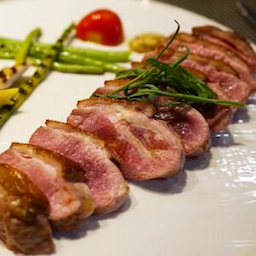
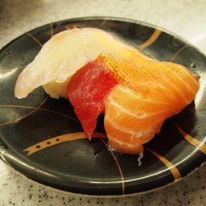

# 2018 Pixnet Hackathon

Data-Magician 參加 2018 年 Pixnet Hackathon Food-AI 競賽相關資料。
比賽內容為 Image inpainting，即將圖像挖空一部分後，透過演算法把挖空的部分補回去。

## File Structure

- [output](output): 透過 Model 產出的圖片結果。
- [code](code): Pixnet API 與 generating inpainting 方法程式範例。
- [pixfood_clean_list](pixfood_clean_list): Pixfood 20 清理過的可用圖片列表。

## 方法

- Survey 相關演算法

由主辦單位提供的 [Globally and locally consistent image completion](http://hi.cs.waseda.ac.jp/~iizuka/projects/completion/en/) 做為參考資料去 Survey 最新研究後，最後決定使用 [Generative Image Inpainting with Contextual Attention](https://github.com/JiahuiYu/generative_inpainting) 來進行實作。且由於組員對 Image Inpainting 沒有經驗，因此直接使用該論文提供的模型實作程式碼，並整合 Pixnel API 來進行資料接受與上傳。

- 蒐集與清理資料

除了主辦方提供的 Pixfood 20 dataset 外，還另外使用了 Food-101，UEC FOOD 100，MMSPG Food-5K，MMSPG Food-11 等資料集，經過簡單的資料篩選跟整理後，留下 147790 張照片(約 8 GB) 來進行訓練工作。

> Pixfood 20 dataset 中有許多非食物以及 Label 錯誤的圖片，因此透過組員手動篩選後另存可用的圖片路徑資料。(放在 pixfood_clean_list folder 中)

- 訓練模型

使用 Google 免費 $300 美金額度的免費額度在 Google Cloud Enginee 的 n2 Standard VM 以及 Nvidia K80，進行訓練。 Batchsize 設為 16 訓練約 170 小時(70000 iterations，No hyperparameter tuning)。

- 測試模型結果

將不同時期的 Model 保留下來後比較結果，選擇認為不錯的 Model 來進行 Image inpainting。

- 整合雙方程式碼

將 generating inpainting 與 pixnet api 範例程式整合，在取得圖片後直接進行 inpainting。

## 執行結果

## 比賽心得

雖然使用 generating inpainting 方式可不錯的成果，但到現場才發現同質性太高，許多組別都使用該篇論文架構來進行訓練並補全影像(少部分使用了其他如 Nvidia 的論文)，推測可能為是題目並沒有特別規定一定要用到文字，而 Image inpainting 已經是一個研究相當多的領域，且該片論文直接提供了 Tensorflow 程式碼與 Tensorboard 實作，導致許多人就直接使用了該論文架構。而分組報告中也有許多人提到圖片資料集錯誤問題，代表都有看過並清理資料集。

如果之後參加比賽需有自己的獨創性，如修改 Model 架構或加入一些後處理動作等，不要從頭到尾都一樣沒修改導致成果撞車。

## Link

- [Pixnet Hackathon](https://pixnethackathon2018-competition.events.pixnet.net/)
- [Pixnet Hackathon -Github](https://github.com/pixnet/2018-pixnet-hackathon/blob/master/demos/foodai/api_test_0731.py)
- [Demo 網頁- https://pixnethackathon2018-competition.events.pixnet.net/](https://pixnethackathon2018-competition.events.pixnet.net/)
